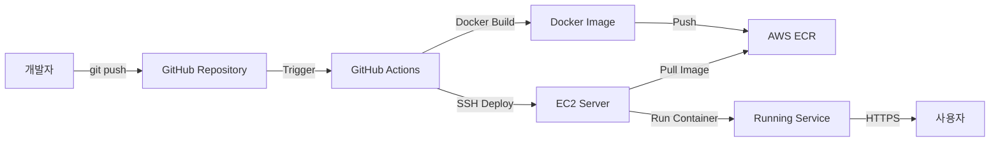
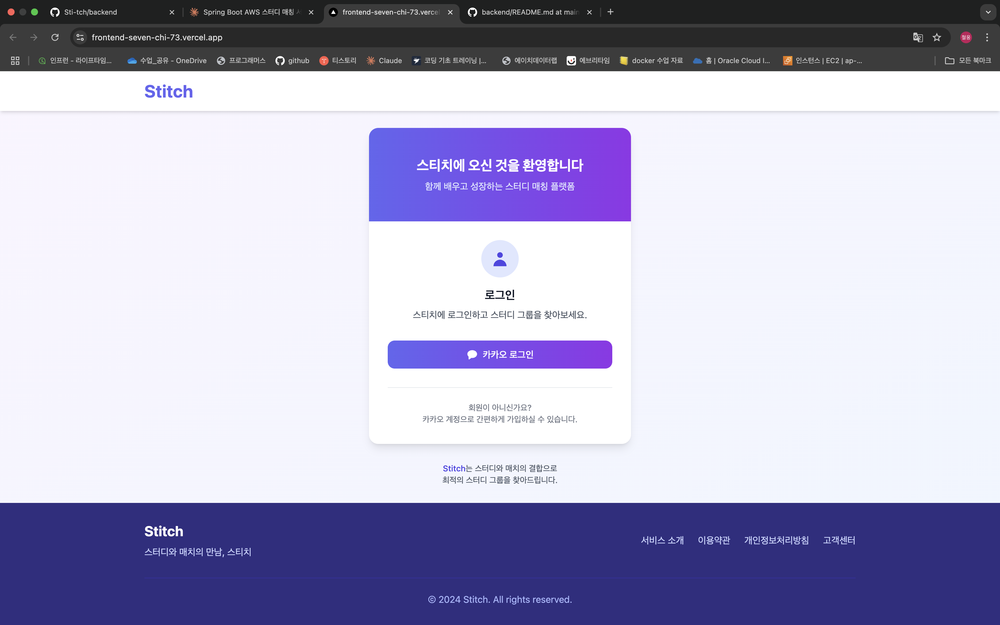
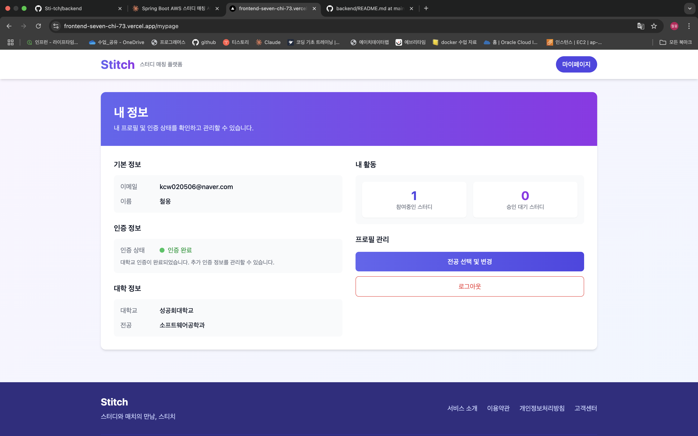
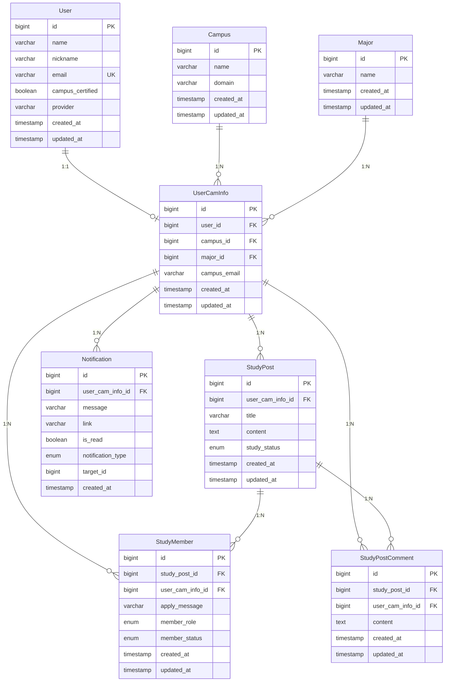

# 📖 Stitch - 대학생 스터디 매칭 서비스

<div align="center">
  
</div>

<div align="center">
  
**배포 URL**: [https://stitch-study.site](https://stitch-study.site)

</div>

## 프로젝트 소개
- **Stitch**는 대학생들이 스터디 그룹을 만들 수 있게 하는 매칭 플랫폼입니다.
- 자신이 공부하고 싶은 분야의 스터디를 자유롭게 만들어 운영할 수 있습니다.
- 검색 기능을 통해 다양한 스터디 그룹을 쉽게 찾아볼 수 있습니다.
- 학교 인증을 통해 대학생들만이 안전하게 이용할 수 있는 서비스입니다.

## 팀원 구성

<div align="center">

### Frontend
| 정민종 |
|:---:|
|  |
| [@owenminjong](https://github.com/owenminjong) |

### Backend
| 정민종 | 강철웅 |
|:---:|:---:|
|  |  |
| [@owenminjong](https://github.com/owenminjong) | [@kangcheolung](https://github.com/kangcheolung) |

</div>

## 기술 스택

### Frontend


### Backend


### DevOps & CI/CD


### API & 문서화


### 배포 & 인프라


### 개발 도구


## CI/CD 아키텍처

### 완전 자동화된 배포 파이프라인



## 역할 분담

### 👨‍💻 정민종 (Frontend & Algorithm)
**Frontend 개발**
- **UI/UX 설계**: 전체 화면 설계 및 사용자 경험 최적화
- **페이지 구현**: 
  - 메인 페이지, 로그인/회원가입 페이지
  - 스터디 목록, 상세, 생성/수정 페이지
  - 마이페이지, 알림 페이지
- **컴포넌트 개발**: 재사용 가능한 UI 컴포넌트 제작 (Lucide React 아이콘 활용)
- **API 연동**: Axios를 통한 백엔드 API 통신
- **라우팅**: React Router DOM을 활용한 페이지 라우팅
- **스타일링**: Tailwind CSS를 활용한 반응형 UI 구현
- **인증 시스템**: NextAuth.js를 활용한 소셜 로그인 구현

**Backend Algorithm**
- **검색 알고리즘**: 스터디 검색 및 필터링 로직 구현
- **매칭 알고리즘**: 사용자 선호도 기반 스터디 추천 시스템

### 👨‍💻 강철웅 (Backend & DevOps)
**인증 및 사용자 관리**
- **OAuth2 인증**: 카카오, 구글, 네이버 소셜 로그인 연동
- **JWT 토큰**: 토큰 기반 인증 시스템 구현
- **대학교 인증**: 이메일 인증을 통한 대학생 검증 시스템
- **사용자 정보 관리**: User, UserCamInfo 도메인 설계 및 구현
- **전공/캠퍼스 관리**: 대학교 및 전공 정보 관리 시스템

**스터디 서비스**
- **스터디 CRUD**: 스터디 게시글 생성, 조회, 수정, 삭제
- **스터디 멤버 관리**: 
  - 가입 신청, 승인/거절 처리
  - 리더 권한 관리, 멤버 역할 시스템
  - 스터디 탈퇴 및 리더 변경 기능
- **댓글 시스템**: 스터디 게시글 댓글 CRUD
- **검색 기능**: 키워드 기반 스터디 검색

**알림 시스템**
- **실시간 알림**: SSE(Server-Sent Events) 기반 실시간 알림
- **알림 유형별 처리**:
  - 스터디 가입 신청 알림
  - 가입 승인/거절 알림  
  - 새 댓글 알림
- **알림 관리**: 읽음 처리, 삭제, 목록 조회

**DevOps & CI/CD**
- **Docker 컨테이너화**: 
  - 멀티스테이지 Dockerfile 작성으로 이미지 크기 최적화
  - 환경변수 기반 설정 관리로 개발/운영 환경 분리
- **GitHub Actions CI/CD**: 
  - 완전 자동화된 배포 파이프라인 구축
  - 코드 푸시 시 자동 빌드, 테스트, 배포 수행
- **AWS ECR**: Docker 이미지 저장소 관리 및 버전 관리
- **보안 관리**: 
  - GitHub Secrets을 통한 민감정보 암호화 관리
  - SSH 키 기반 서버 인증 시스템

**배포 & 인프라**
- **Frontend (Vercel)**:
  - 플랫폼: Vercel을 통한 자동 배포
  - 도메인: 커스텀 도메인 연결 (`stitch-study.site`)
- **Backend (AWS)**:
  - 인스턴스: Amazon EC2 Linux 서버 운영
  - 데이터베이스: AWS RDS MySQL 연동
  - 웹 서버: Nginx 리버스 프록시 설정
  - SSL 인증서: Let's Encrypt를 통한 HTTPS 보안 연결

## 주요 기능

### 🔐 로그인 및 인증
<div align="center">
  
</div>

- **소셜 로그인**: 카카오, 구글, 네이버 OAuth2 기반 로그인
- **대학교 이메일 인증**: 학생 신분 확인을 위한 이메일 인증 시스템
- **보안**: JWT 토큰 기반 인증 및 권한 관리

### 👤 마이페이지
<div align="center">
  
</div>

- **프로필 관리**: 개인정보 및 프로필 사진 수정
- **참여 스터디 현황**: 내가 참여 중인 스터디 목록 확인
- **활동 내역**: 스터디 참여 기록 및 통계
- **설정**: 알림 설정 및 계정 관리

### 🔍 스터디 찾기
<div align="center">
 <video src="https://github.com/user-attachments/assets/8a04b77d-855d-4191-85e5-875bc053f20d" width="300" controls></video>
</div>

- **키워드 검색**: 스터디 제목, 내용 기반 검색
- **필터링**: 카테고리, 모집 상태, 지역별 필터
- **실시간 업데이트**: 새로운 스터디 자동 갱신
- **상세 정보**: 스터디 상세 페이지에서 모든 정보 확인

### ✨ 스터디 만들기
<div align="center">
 <video src="https://github.com/user-attachments/assets/6616c60b-7d3b-49cb-978c-594a7ab2f381" width="300" controls></video>
</div>

- **직관적인 폼**: 제목, 내용, 카테고리 등 간편한 입력
- **실시간 미리보기**: 작성 중인 내용을 실시간으로 확인
- **모집 조건 설정**: 인원 수, 모집 기간, 참여 조건 설정
- **즉시 게시**: 작성 완료 후 바로 다른 사용자들에게 노출

### 🛠️ 스터디 수정 & 삭제
<div align="center">
 <video src="https://github.com/user-attachments/assets/79a01cc6-269f-4557-ac84-e5e04179e179" width="300" controls></video>
 <video src="https://github.com/user-attachments/assets/95997bda-12d4-4c11-803d-3029b9351523" width="300" controls></video>
</div>

- **리더 권한**: 스터디 생성자만 수정/삭제 가능
- **유연한 수정**: 내용, 모집 조건, 상태 등 언제든 수정
- **안전한 삭제**: 확인 절차를 통한 신중한 삭제 처리
- **멤버 관리**: 참여자 승인/거절, 역할 변경 기능

### 💬 댓글 생성 & 수정 & 삭제
<div align="center">
  <video src="https://github.com/user-attachments/assets/953846c3-3c36-4027-95ef-ecb12c3805a1" width="300" controls></video>
</div>

- **실시간 댓글**: 스터디에 대한 질문과 답변 실시간 소통
- **인라인 편집**: 댓글 작성 후 바로 수정 가능
- **작성자 권한**: 본인이 작성한 댓글만 수정/삭제 가능
- **알림 연동**: 새 댓글 작성 시 스터디 멤버들에게 알림 발송

### 📝 스터디 가입 신청
<div align="center">
  <video src="https://github.com/user-attachments/assets/250fb2ff-b6af-4933-8fef-141de580f848" width="300" controls></video>
</div>

- **간편한 신청**: 원클릭으로 스터디 가입 신청
- **신청 메시지**: 자기소개 및 참여 동기 작성
- **실시간 알림**: 신청 즉시 스터디 리더에게 알림 전송
- **신청 현황**: 내 신청 상태를 실시간으로 확인

### ✅ 스터디 가입 승인 & 거절
<div align="center">
  <video src="https://github.com/user-attachments/assets/0ebaa8cf-0030-4bfb-9fb6-6fa20a14b049" width="300" controls></video>
</div>

- **리더 권한**: 스터디 생성자만 멤버 승인/거절 가능
- **신청자 정보**: 지원자의 프로필과 신청 메시지 확인
- **즉시 처리**: 승인/거절 즉시 신청자에게 알림 전송
- **멤버 관리**: 승인된 멤버들의 역할 및 상태 관리

<div align="center">
  <video src="https://github.com/user-attachments/assets/0560666f-44fd-4c0e-9411-7e7ad0ca6f9b" width="300" controls></video>
</div>

- **정중한 거절**: 거절 사유를 포함한 알림 발송
- **재신청 가능**: 거절 후에도 재신청 기회 제공

### 👑 스터디 리더 변경
<div align="center">
  <video src="https://github.com/user-attachments/assets/0f06bada-28d7-49c5-a27c-78867bef10e6" width="300" controls></video>
</div>

- **리더 위임**: 현재 리더가 다른 멤버에게 리더 권한 이양
- **권한 이전**: 스터디 관리 권한이 새로운 리더에게 완전 이전
- **알림 발송**: 모든 멤버에게 리더 변경 알림
- **연속성 보장**: 스터디 운영의 지속성 확보

### 🚪 스터디 탈퇴 & 로그아웃
<div align="center">
  <video src="https://github.com/user-attachments/assets/739c0aa2-fb1a-4b31-bbdd-7cb8d2028730" width="300" controls></video>
</div>

- **자유로운 탈퇴**: 언제든지 스터디에서 나갈 수 있음
- **확인 절차**: 실수 방지를 위한 탈퇴 확인 단계
- **알림 처리**: 탈퇴 시 리더 및 멤버들에게 알림
- **데이터 정리**: 탈퇴 후 개인정보 보호를 위한 데이터 처리

<div align="center">
  <video src="https://private-user-images.githubusercontent.com/112637112/468495624-8de96740-ec78-4c47-bb94-8b023aa047ff.mov?jwt=eyJhbGciOiJIUzI1NiIsInR5cCI6IkpXVCJ9.eyJpc3MiOiJnaXRodWIuY29tIiwiYXVkIjoicmF3LmdpdGh1YnVzZXJjb250ZW50LmNvbSIsImtleSI6ImtleTUiLCJleHAiOjE3NTMwODI3NTMsIm5iZiI6MTc1MzA4MjQ1MywicGF0aCI6Ii8xMTI2MzcxMTIvNDY4NDk1NjI0LThkZTk2NzQwLWVjNzgtNGM0Ny1iYjk0LThiMDIzYWEwNDdmZi5tb3Y_WC1BbXotQWxnb3JpdGhtPUFXUzQtSE1BQy1TSEEyNTYmWC1BbXotQ3JlZGVudGlhbD1BS0lBVkNPRFlMU0E1M1BRSzRaQSUyRjIwMjUwNzIxJTJGdXMtZWFzdC0xJTJGczMlMkZhd3M0X3JlcXVlc3QmWC1BbXotRGF0ZT0yMDI1MDcyMVQwNzIwNTNaJlgtQW16LUV4cGlyZXM9MzAwJlgtQW16LVNpZ25hdHVyZT1hZmE3OGYzMWM1Y2MxMWVmY2Y3OTJmODJmNjc3MWVjODNjMDNjYjBjZGM1MjVhYTNhNTk1OWY3Y2IxM2MxOWYzJlgtQW16LVNpZ25lZEhlYWRlcnM9aG9zdCJ9.0HYuApY7n-P-75HAm055hlp4AxdmNNF3-fBlPA4eer8" width="300" controls></video>
</div>

- **안전한 로그아웃**: 토큰 무효화 및 세션 정리
- **사용자 친화적 UI**: 직관적인 로그아웃 프로세스

### 🎓 기타 핵심 기능
- **대학교 이메일 인증**: SMTP 기반 실시간 이메일 인증으로 대학생 신분 확인
- **실시간 알림 시스템**: SSE(Server-Sent Events) 기반 즉시 알림 전달 서비스
- **스터디 매칭 알고리즘**: 전공, 캠퍼스, 관심분야 기반 맞춤형 스터디 추천 시스템

## ERD


## 프로젝트 구조

### Frontend
```
frontend [webapp]/
├── .idea/
├── .next/
├── app/
│   ├── api/
│   ├── components/
│   ├── home/
│   ├── major-selection/
│   ├── my-studies/
│   ├── mypage/
│   ├── services/
│   ├── study/
│   ├── university-certification/
│   ├── _app.js
│   ├── favicon.ico
│   ├── globals.css
│   ├── layout.js
│   ├── page.js
│   └── page.module.css
├── node_modules/
├── public/
├── .eslintrc.json
├── .gitignore
├── jsconfig.json
├── next.config.js
├── package.json
├── package-lock.json
├── postcss.config.js
├── README.md
└── tailwind.config.js
```

### Backend
```
backend [stitch]/
├── .github/
├── .gradle/
├── .idea/
├── gradle/
├── stitch-api/
│   ├── build/
│   ├── gradle/
│   └── src/
│       └── main/
│           └── java/
│               └── se.sowl.stitchapi/
│                   ├── campus/          # 캠퍼스 관련 Controller, Service, DTO
│                   ├── common/          # 설정 파일들 (Config, Security, JWT 등)
│                   ├── exception/       # 예외 처리
│                   ├── major/           # 전공 관련 Controller, Service, DTO
│                   ├── notification/    # 알림 관련 Controller, Service, DTO
│                   ├── oauth/           # OAuth 인증 Controller, Service, DTO
│                   ├── study/           # 스터디 관련 Controller, Service, DTO
│                   ├── univcert/        # 대학교 인증 Controller, Service, DTO
│                   ├── user/            # 사용자 관리 Controller, Service, DTO
│                   ├── user_cam_info/   # 사용자 캠퍼스 정보 Controller, Service, DTO
│                   └── StitchApiApplication
├── stitch-domain/
│   ├── build/
│   ├── gradle/
│   └── src/
│       └── main/
│           └── java/
│               └── se.sowl.stitchdomain/
│                   ├── notification/    # 알림 Entity, Repository, Enum
│                   ├── oauth.domain/    # OAuth Entity, Repository, Enum
│                   ├── school/          # 학교 관련 Entity, Repository, Enum
│                   ├── study/           # 스터디 관련 Entity, Repository, Enum
│                   └── user/            # 사용자 Entity, Repository, Enum
├── build.gradle
├── .gitignore
├── gradlew
├── gradlew.bat
├── README.md
└── settings.gradle
```
